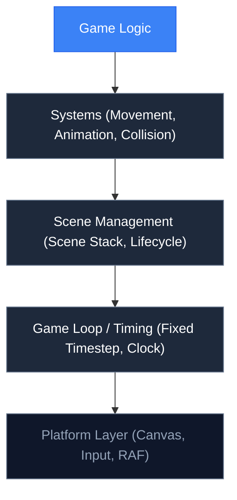

---
prev:
  text: 'The Architecture Philosophy'
  link: '/0-welcome/philosophy'
---

# 1.1 What is a Game Engine?


## Concept

A game engine is a software framework that provides common infrastructure so you do not rebuild it for every project.

Think of a film studio. It has sound stages, cameras, lighting rigs, and editing suites. When a director makes a movie, they do not build a new studio from scratch. They use the existing one and focus on the creative work.

A game engine works the same way. It provides:

- A **game loop** that runs at a consistent speed
- **Rendering** to display graphics on screen
- **Input handling** for keyboard, mouse, touch, and gamepad
- **Scene management** to organize what is on screen
- **Asset loading** for images, sounds, and data

Without an engine, you write all of this from scratch. With an engine, you import it and write only the parts specific to your game.

## Problem

Suppose you want to make a simple game — a character that moves around a canvas.

You need a window that displays graphics. You need to read keyboard input. You need to update the character position every frame. You need to draw the character. You need the game to run at the same speed on different computers.

Writing this from scratch for every project means repeating the same setup code. The setup has nothing to do with your game's unique logic — it is infrastructure. Every game needs it, but it does not differentiate your game.

The problem is not just repetition. It is also correctness. A game loop that works on your machine might run at double speed on a faster machine. Input handling needs to account for browser quirks. Rendering requires understanding the Canvas API in detail.

An engine abstracts these concerns so you can focus on gameplay.

## Naive Implementation

Here is what a minimal game looks like without an engine:

```js
const canvas = document.createElement("canvas")
canvas.width = 800
canvas.height = 600
document.body.appendChild(canvas)
const ctx = canvas.getContext("2d")

const player = { x: 400, y: 300 }

document.addEventListener("keydown", (e) => {
  if (e.key === "ArrowLeft")  player.x -= 10
  if (e.key === "ArrowRight") player.x += 10
  if (e.key === "ArrowUp")    player.y -= 10
  if (e.key === "ArrowDown")  player.y += 10
})

function loop() {
  ctx.clearRect(0, 0, 800, 600)
  ctx.fillStyle = "blue"
  ctx.fillRect(player.x, player.y, 32, 32)
  requestAnimationFrame(loop)
}

loop()
```

This works. But it has problems:

- Movement speed depends on frame rate (faster on a 144 Hz display than 60 Hz)
- Keyboard input is handled directly on the document, not scoped to the game
- There is no scene management — adding a menu screen or pause screen requires restructuring everything
- There is no way to compose entities — adding enemies means duplicating the pattern
- The canvas setup is hardcoded — changing resolution requires editing the source

For a simple demo, these are acceptable. For a real game, they become blockers.

## Engine Solution

A game engine provides all of this infrastructure behind a clean interface. jygame organizes its services into logical layers:



Each layer depends on the layers below it. Your game code (top) depends on systems, which depend on scene management, which depends on the game loop, which depends on the platform.

jygame is a framework-style engine. You import it, and it drives your code through callbacks — the scene lifecycle hooks (`enter`, `update`, `render`, `exit`). This is different from a library, where you call into the engine when you need something and keep control of your own main loop.

jygame owns:

- The **game loop** — it decides when to update and render
- The **timestep** — it controls simulation speed
- The **scene stack** — it manages scene lifecycles

Your code owns the **game logic** — what happens during updates, what is drawn during rendering.

## Code Walkthrough

`core/Game.js:6`

The `Game` class is the engine's entry point. Its constructor sets up the canvas, the clock, input handling, and scene management:

```js
constructor({ parent, width, height, fps = 60, maxTicks = 5, autoPause = true, scaleToFit = null }) {
  const container = typeof parent === "string"
    ? document.querySelector(parent)
    : parent

  this.canvas = document.createElement("canvas")
  this.canvas.width = width
  this.canvas.height = height
  container.appendChild(this.canvas)

  this.ctx = this.canvas.getContext("2d")
  this.clock = new Clock(fps, maxTicks)
  this._sceneStack = []
  this.input = new InputContext()
  this.input.init(container)
}
```

Key design decisions visible here:

- The engine creates the canvas for you — you do not manage DOM elements
- The clock is created with your target framerate — timing is the engine's responsibility
- Input is initialized on the container — events are scoped to the game area, not the whole document
- The scene stack is empty — you push scenes into it as your game runs

`core/Game.js:228`

The `run()` method starts the loop:

```js
run(scene) {
  this._sceneStack = [scene]
  this._mountScene(scene)
  this.clock.reset()
  this._running = true
  this._lastTime = performance.now()
  this._rafId = requestAnimationFrame((t) => this._loop(t))
}
```

`run()` takes a `Scene` instance, mounts it (which calls the scene's `enter()` lifecycle hook), resets the clock, and starts the animation frame loop. The scene does not need to know about canvases, clocks, or input — it just implements `update(dt)` and `render(ctx)`.

`core/Scene.js`

The `Scene` base class defines the lifecycle contract:

```js
export class Scene {
  constructor() {
    this._entered = false
    this._exited = false
    this._game = null
    this.root = null
  }

  enter() {}
  exit() {}
  pause() {}
  resume() {}
  update(dt) {}
  render(ctx) {}
  renderUI() {}
  interpolate(alpha) {}
}
```

Every method is optional. If your scene does not need `pause()` logic, you do not implement it. The engine checks for method existence before calling.

## Advanced

Not every project needs an engine. For a simple demo or prototype, the naive approach may be faster — no engine to learn, no framework abstractions to navigate. The tradeoff is that as the project grows, the cost of the missing abstractions compounds.

Different engines make different tradeoffs:

- **Unity/Unreal** provide editors, asset pipelines, physics, audio, networking, and more. They are powerful but have steep learning curves and large build sizes.
- **Phaser/PixiJS** are 2D-focused renderers with game loop integration but limited architectural opinions. They are lighter than Unity but still heavier than jygame.
- **jygame** is a learning-oriented engine. It provides the essential patterns (game loop, scene stack, ECS, fixed timestep) in a small, readable codebase. It is not designed for shipping commercial games — it is designed for understanding how engines work.

The choice is about the right level of abstraction. Too little abstraction (the naive approach) and you rebuild infrastructure for every project. Too much abstraction (Unity for a simple 2D game) and you fight the engine more than you benefit from it. jygame sits at a sweet spot for learning: it has enough architecture to be instructive but is small enough to read in full.
