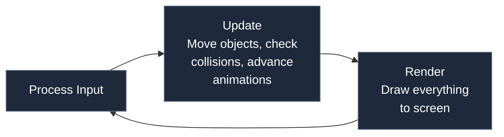

# 1.2 The Game Loop


## Concept

A game is not like a static web page. A web page loads, displays content, and waits for the user to interact. A game continuously changes — objects move, animations play, physics simulates — even when the player is not doing anything.

This continuous change happens inside a **game loop**: an infinite cycle that runs as long as the game is open.



The three steps — process input, update, render — repeat until the game closes. Every game engine has some version of this loop.

## Problem

A naive infinite loop runs as fast as the computer can execute it.

On a 60 Hz monitor, the screen refreshes 60 times per second. If your loop runs at 6000 iterations per second, you update the game 6000 times per second but the screen only shows 60 of those updates. The other 5940 are wasted computation.

Worse, the game runs at different speeds on different hardware. A fast computer updates more times per second, making objects move faster. A slow computer updates fewer times, making objects move slower. The game's feel becomes dependent on the player's hardware.

This is called **frame rate dependence** — the simulation speed is tied to the display refresh rate. It is the first problem a game engine must solve.

## Naive Implementation

In the browser, `requestAnimationFrame` synchronizes your code with the display refresh:

```js
function gameLoop(timestamp) {
  update()
  render()
  requestAnimationFrame(gameLoop)
}

requestAnimationFrame(gameLoop)
```

On a 60 Hz display, this calls `gameLoop` approximately every 16.67 ms. On a 144 Hz display, approximately every 6.94 ms.

This is better than a raw `while` loop because it does not waste CPU cycles between frames. But it still has the speed problem. At 144 Hz, `update()` runs 144 times per second. At 60 Hz, it runs 60 times per second. The simulation is still frame-rate-dependent.

## Engine Solution

The solution is to separate **update speed** from **render speed**.

Render happens once per frame, synchronized with the display. Update happens at a fixed rate — independent of the display refresh rate.

This is called a **fixed timestep**. The game always updates at the same rate. Rendering draws whatever state the game is in at that moment.

The core mechanism is an **accumulator** that tracks how much real time has passed and runs exactly as many fixed-size updates as needed:

```js
const FIXED_DT = 1 / 60
let accumulator = 0
let lastTime = performance.now()

function gameLoop(currentTime) {
  const frameTime = (currentTime - lastTime) / 1000
  lastTime = currentTime
  accumulator += frameTime

  while (accumulator >= FIXED_DT) {
    update(FIXED_DT)
    accumulator -= FIXED_DT
  }

  render()
  requestAnimationFrame(gameLoop)
}
```

Each update call receives the same `dt` value (1/60). The simulation is deterministic — a 30 FPS display and a 144 FPS display produce identical results. If a frame takes longer than 1/60, the while loop runs multiple updates to catch up.

## Code Walkthrough

`time/Clock.js:35`

The `Clock` class implements the accumulator pattern in 51 lines:

```js
tick(realDt) {
  this._accumulator += Math.min(realDt, this._maxDelta)
  let count = 0
  while (this._accumulator >= this._fixedDt && count < this._maxTicks) {
    this._accumulator -= this._fixedDt
    count++
  }
  if (count >= this._maxTicks) {
    this._accumulator = 0
  }
  return count
}
```

Key details:

- `this._fixedDt` is `1 / fps` — configurable per-game (default 1/60)
- `this._maxDelta` caps the real elapsed time to 0.2 seconds, preventing a huge catch-up after the tab is backgrounded
- `this._maxTicks` limits the number of updates per frame to 5, preventing the **spiral of death** — a situation where the game cannot keep up and the accumulator grows unbounded
- The method returns `count`, the number of updates to run. If zero, no update is needed

`core/Game.js:368`

The `Game` class integrates the clock into its `_loop()` method:

```js
_loop(time) {
  if (!this._running) return
  if (this._paused) {
    this._rafId = requestAnimationFrame((t) => this._loop(t))
    return
  }

  const realDt = (time - this._lastTime) / 1000
  this._lastTime = time
  const ticks = this.clock.tick(realDt)
  const updateStart = this._findBlockingIndex("blocksUpdateBelow")
  const renderStart = this._findBlockingIndex("blocksRenderBelow")

  this._updating = true

  if (ticks > 0) {
    this._updateScenes(this.clock.fixedDt, updateStart)
    this.input.clearJustPressed()
    for (let i = 1; i < ticks; i++) {
      this._updateScenes(this.clock.fixedDt, updateStart)
    }
  }

  this.input.updateFrame()
  this._interpolateScenes(this.clock.alpha, updateStart)
  this._updating = false
  this._flushSceneOps()

  this.ctx.clearRect(0, 0, this.width, this.height)
  this._renderScenes(this.ctx, renderStart)

  this._rafId = requestAnimationFrame((t) => this._loop(t))
}
```

The flow:

1. Compute `realDt` — the actual wall-clock time since the last frame
2. Call `clock.tick(realDt)` — returns how many fixed-step updates to run
3. Run that many updates, passing `this.clock.fixedDt` as the delta time
4. Call `interpolate()` on scenes with `this.clock.alpha` (the fraction of time into the next update tick)
5. Flush any scene operations that were queued during updates (push, pop, replace)
6. Clear the canvas and render all scenes

The `_findBlockingIndex` calls determine which scenes receive updates and renders. A scene can block scenes below it from updating or rendering — this enables pause menus and overlay scenes without special-case logic.

## Advanced

The separation of update and render rates creates a tension. If updates run at 60 Hz but the display runs at 120 Hz, the same state is rendered twice. This can appear stuttery for fast-moving objects unless you implement **interpolation** — blending between the previous and next update states using the `alpha` value.

jygame's clock exposes `alpha` (0.0 to 1.0) representing how far between updates the current render falls. Scenes receive `interpolate(alpha)` calls after updates and before rendering, allowing them to smooth visual positions.

The spiral of death protection (`maxTicks`) is a tradeoff. If the game falls behind by more than 5 update ticks, the excess time is discarded. The game slows down rather than crashing, but the simulation loses those discarded milliseconds. For particle effects this is acceptable. For frame-perfect gameplay it would not be.
