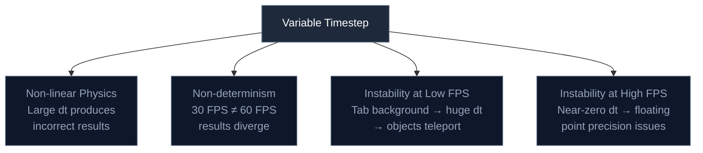

# 1.3 Fixed vs Variable Timestep


## Concept

**Timestep** is the amount of simulated time that passes in one update tick. If your game updates 60 times per second, each timestep is 1/60 of a second (about 16.67 ms). If it updates once per second, each timestep is one full second.

The choice is between two approaches: **variable timestep**, where `dt` changes every frame based on real elapsed time, and **fixed timestep**, where `dt` is always the same value.

## Problem

Variable timestep seems correct at first. If a frame takes twice as long, you pass a larger `dt` and objects move twice as far. The game should run at the same speed regardless of frame rate.

In practice, variable timestep introduces subtle but critical problems.



The worst case is a bouncing ball with collision: a large timestep can skip past the collision entirely — the ball passes through the floor because the collision check never sees it in the ground plane.

## Naive Implementation

Variable timestep uses the actual elapsed time between frames:

```js
let lastTime = performance.now()

function gameLoop(currentTime) {
  const dt = (currentTime - lastTime) / 1000
  lastTime = currentTime

  player.x += player.speed * dt
  player.velocity += gravity * dt
  player.y += player.velocity * dt

  if (player.y > groundY) {
    player.y = groundY
    player.velocity *= -bounce
  }

  requestAnimationFrame(gameLoop)
}
```

Observation: The frame rate of the display determines the timestep. On a 60 Hz display, `dt` averages 0.0167. On a 144 Hz display, `dt` averages 0.0069. The physics integration uses different step sizes, producing different results over time.

The failure modes:

- **Non-linear physics.** The gravity integration `velocity += gravity * dt` assumes constant acceleration over the timestep. With a large `dt`, this approximation loses accuracy.
- **Non-determinism.** A game running at 30 FPS and 60 FPS will diverge because the integration paths differ. Replays, networking, and debugging become unreliable.
- **Tab backgrounding.** When the browser tab returns from background, the first frame may have a `dt` of several seconds. The player teleports. The ball passes through the wall.
- **High frame rates.** At 240+ FPS, `dt` approaches zero. Floating point precision causes velocities multiplied by near-zero timesteps to produce sub-pixel movements.

## Engine Solution

Fixed timestep uses the same `dt` every update, regardless of real elapsed time:

```js
const FIXED_DT = 1 / 60
let accumulator = 0
let lastTime = performance.now()

function gameLoop(currentTime) {
  const frameTime = (currentTime - lastTime) / 1000
  lastTime = currentTime
  accumulator += frameTime

  while (accumulator >= FIXED_DT) {
    update(FIXED_DT)
    accumulator -= FIXED_DT
  }

  requestAnimationFrame(gameLoop)
}
```

Every `update()` call receives exactly `1/60`. Physics, collision, and particle simulation are deterministic. A 30 Hz display and a 144 Hz display produce identical simulation results.

Fixed timestep solves:

- **Consistent physics.** The same step size every time means the integration is always the same approximation
- **Determinism.** Frame rate does not affect simulation results
- **Tab backgrounding.** Large frame gaps run multiple updates to catch up (up to the max tick limit)
- **Precision.** The step size is always the same, so floating point behavior is predictable

## Code Walkthrough

`time/Clock.js:1`

The `Clock` class encapsulates fixed timestep management:

```js
export class Clock {
  constructor(fps = 60, maxTicks = 5) {
    this._fps = fps
    this._fixedDt = 1 / fps
    this._maxDelta = 0.2
    this._maxTicks = maxTicks
    this._accumulator = 0
  }

  get fixedDt() {
    return this._fixedDt
  }

  get alpha() {
    return this._fixedDt > 0
      ? this._accumulator / this._fixedDt
      : 0
  }

  tick(realDt) {
    this._accumulator += Math.min(realDt, this._maxDelta)
    let count = 0
    while (this._accumulator >= this._fixedDt && count < this._maxTicks) {
      this._accumulator -= this._fixedDt
      count++
    }
    if (count >= this._maxTicks) {
      this._accumulator = 0
    }
    return count
  }
}
```

Three design decisions worth examining:

**`_maxDelta = 0.2`.** If the browser tab was backgrounded for 10 seconds, the first frame's `realDt` would be 10. Without clamping, the accumulator would grow to 10, triggering 600 updates in a single frame. The game would freeze while catching up. Clamping to 0.2 seconds limits the catch-up to 12 updates at most.

**`_maxTicks = 5`.** Even with clamping, a sustained load could cause the accumulator to grow. After 5 consecutive updates without draining the accumulator, the remaining time is discarded. This prevents the spiral of death — a game that falls behind forever. The tradeoff is that simulation time is lost.

**`alpha`.** When the display refresh rate is higher than the update rate, the renderer can interpolate between the last two update states. `alpha` represents how far into the next update tick the current render falls, from 0.0 (just finished an update) to nearly 1.0 (about to start the next update).

`core/Game.js:394`

The game loop uses `alpha` for interpolation:

```js
this._interpolateScenes(this.clock.alpha, updateStart)
```

Scenes can implement `interpolate(alpha)` to smooth visual positions between update ticks, giving the appearance of higher frame rate simulation even though updates run at the fixed rate.

## Advanced

### Interpolation

When the display refresh rate exceeds the update rate, the same simulation state is rendered multiple times. At 120 Hz display with 60 Hz updates, each state is shown for two consecutive frames. For fast-moving objects, this creates visible stutter — the motion appears to jump between positions rather than moving smoothly.


**Interpolation** solves this by estimating where objects should be between update ticks. Instead of rendering the last known state, the renderer blends between the previous and next states using the `alpha` value from the clock.


`alpha` represents the fraction of time elapsed since the last update, from 0.0 (just finished an update) to nearly 1.0 (about to start the next). To interpolate a position:

```js
function interpolate(alpha) {
  for (const entity of entities) {
    if (entity.transform) {
      entity.transform.renderX = entity.transform.prevX
        + (entity.transform.x - entity.transform.prevX) * alpha
    }
  }
}
```

After each update, `prevX` is set to `x`. During `interpolate(alpha)`, `renderX` is computed as a linear blend between the two. The render system uses `renderX` instead of `x`, producing smooth visual motion.


Under the hood, interpolation is a tradeoff. It adds smoothness at the cost of a frame of latency — the rendered position always lags slightly behind the simulation because it blends between past and current states. For visual effects this is imperceptible. For gameplay it can matter (a player aiming at a moving target sees a slightly delayed position).

### Fixed Timestep Costs

Fixed timestep is not free:

- **CPU usage is higher.** At 60 updates per second, the game consumes more CPU than a variable timestep game that might skip updates when nothing changes. On battery-powered devices, this matters.
- **The spiral of death is a real risk.** If the CPU cannot sustain 60 updates per second, the game slows down permanently after `maxTicks` is exceeded.

Some engines use a **semi-fixed timestep** — they run a fixed update rate but skip updates if the frame budget is exceeded, trading accuracy for battery life. Others use **substep physics** — running multiple small physics steps within a single update tick to maintain accuracy with larger timesteps.

jygame's choice of fixed timestep is motivated by the particle system. Particles use numerical integration (position += velocity * dt), modifier stacks (sequential force application), and deterministic death sweep (compaction based on life). These all benefit from a consistent `dt`. The complexity of the accumulator is isolated in the clock; game code receives a predictable timestep and does not need to think about timing.
