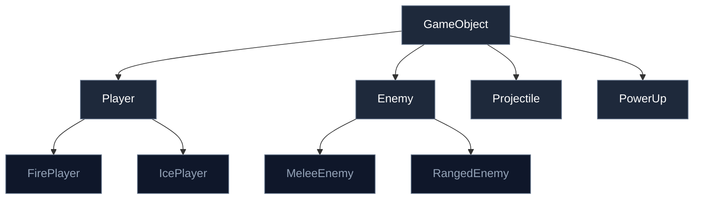
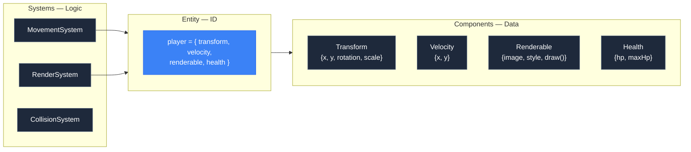

# 1.4 Entities, Components, Systems


## Concept

Most beginner game tutorials teach you to create a class called `Player` or `Enemy` that contains everything — position, velocity, image, health, animation state, collision logic, and rendering code. This is called the **class-based** or **inheritance-based** approach.

As games grow, this approach breaks down. The alternative is **Entity-Component-System (ECS)** — an architectural pattern that separates data from behavior.

**Entity.** A unique identifier that groups components together. It has no behavior itself.

**Component.** A container for data. Position, velocity, health — each is a component with fields but no methods.

**System.** Logic that operates on entities that have specific components. MovementSystem reads Position and Velocity. RenderSystem reads Position and Renderable.

## Problem

Consider what happens when you use class inheritance for game objects.



Now add a burning effect that slows movement and changes color. Where does it go? You either add it to every class that can burn, or create a `BurningGameObject` intermediate class that multiplies the hierarchy further.

The problems:

- **Duplication.** Both `Player` and `Enemy` need position and velocity. You either duplicate the code or push it into a base class that grows fat with features not every subclass needs.
- **Rigidity.** Adding a cross-cutting behavior like "can burn" means modifying every relevant class in the hierarchy.
- **Testing.** Testing movement requires constructing a fully initialized entity with rendering resources, collision geometry, and animation state.
- **Composability.** You cannot easily mix and match behaviors. A flying, burning, healing-over-time enemy requires a specific combination that may not exist in the class hierarchy.

## Naive Implementation

Here is the inheritance approach:

```js
class Player {
  constructor() {
    this.x = 0
    this.y = 0
    this.speed = 200
    this.hp = 100
    this.image = loadImage("player.png")
    this.animationFrame = 0
  }

  update(dt) {
    if (keys.ArrowLeft)  this.x -= this.speed * dt
    if (keys.ArrowRight) this.x += this.speed * dt
  }

  render(ctx) {
    ctx.drawImage(this.image, this.x, this.y)
  }
}
```

For two entities (Player, Enemy) this is manageable. For twenty, the hierarchy becomes brittle. Adding a "can burn" effect requires modifying every entity that can burn, or adding a `Burning` mixin that each class must explicitly include.

The failure mode: you end up with deep inheritance hierarchies, duplicated logic across branches, or a `GameObject` base class that takes 15 constructor parameters because it must accommodate every possible combination of features.

## Engine Solution — ECS

ECS replaces inheritance with composition. There are no `Player` or `Enemy` classes. There are only entities (IDs), components (data), and systems (logic).



In jygame, entities are plain objects with component properties:

```js
const player = {
  transform: { x: 100, y: 200, rotation: 0, scale: { x: 1, y: 1 } },
  velocity: { x: 0, y: 0 },
  renderable: { image: playerImg, style: "fill", draw: null },
  health: { hp: 100, maxHp: 100 },
  visible: true
}
```

There is no `Player` class. There are no instance checks. Any object with `transform` and `velocity` can be processed by MovementSystem. Any object with `renderable` and `transform` can be drawn by RenderSystem. The entity's "type" is determined by which components it has, not by its position in a class hierarchy.

Components are pure data containers:

```js
const transform = { x: 0, y: 0, rotation: 0, scale: { x: 1, y: 1 } }
const velocity = { x: 0, y: 0 }
```

No methods, no constructors, no validation. Just fields.

Systems check for the components they need and operate on matching entities:

```js
const movementSystem = {
  update(entities, dt) {
    for (const entity of entities) {
      if (entity.velocity && entity.transform) {
        entity.transform.x += entity.velocity.x * dt
        entity.transform.y += entity.velocity.y * dt
      }
    }
  }
}
```

The system does not care about the entity's type. It does not care what other components exist. It checks for `velocity` and `transform`, and if both are present, it processes them.

## Code Walkthrough

`display/Sprite.js:1`

The `Sprite` class is a convenience builder that creates the common component set:

```js
export class Sprite {
  constructor({ x, y, width, height }) {
    this.transform = new Transform({ x, y })
    this.collider = new Collider({ width, height })
    this.renderable = new Renderable()
    this.animation = new Animation()
  }

  get x() { return this.transform.x }
  set x(v) { this.transform.x = v }
  // ... more getters/setters for position, size, angle, scale, image
}
```

`Sprite` does not add new behavior. It composes existing components and provides property accessors for convenience. The underlying data is still just component objects attached to a plain entity.

`display/Group.js:1`

`Group` manages collections of entities and provides collision queries:

```js
export class Group {
  constructor() {
    this.children = []
    this._spatialHash = null
  }

  add(sprite) {
    this.children.push(sprite)
  }

  remove(sprite) {
    const i = this.children.indexOf(sprite)
    if (i !== -1) this.children.splice(i, 1)
  }

  useSpatialHash(cellSize) {
    this._spatialHash = new SpatialHash(cellSize)
  }
}
```

Groups are how the engine organizes entities for system iteration. Systems receive a group and iterate its children.

`systems/MovementSystem.js:1`

```js
export const movementSystem = {
  update(entities, dt) {
    for (const entity of entities) {
      if (entity.velocity && entity.transform) {
        entity.transform.x += entity.velocity.x * dt
        entity.transform.y += entity.velocity.y * dt
      }
    }
  }
}
```

This is the canonical ECS system pattern: iterate, check for required components, operate on the data. Fifteen lines, no inheritance, no type checking.

`systems/RenderSystem.js:1`

```js
export class RenderSystem {
  update(entities, dt, ctx, camera) { }
  render(entities, ctx, camera) {
    for (const entity of entities) {
      if (!entity.visible) continue
      ctx.save()
      ctx.translate(entity.transform.x, entity.transform.y)
      // ... apply rotation, scale
      if (entity.renderable) {
        entity.renderable.draw(ctx, entity)
      }
      ctx.restore()
    }
  }
}
```

RenderSystem does not care what an entity is. It only cares what components it has. A player with `visible: true`, `transform`, and `renderable` gets drawn the same way as a particle with the same components.

## Advanced

Traditional ECS implementations (EnTT, Flecs, Unity DOTS) use a stricter data model:

- **Entities are integer IDs**, not objects. An ID maps into parallel arrays of components.
- **Components are stored in dense arrays** (Structure of Arrays), one per component type. All positions are in one `Float32Array`, all velocities in another.
- **Systems query archetypes** — sets of component types that an entity possesses. Queries are pre-computed, and iteration is over contiguous memory.

jygame's ECS is simplified:

- **Entities are objects.** This makes debugging easier (inspect with `console.log`) but loses cache locality. Accessing `entity.transform.x` is a property lookup through the prototype chain, not an indexed array access.
- **Components are object properties.** Adding a component is `entity.newField = value`. No archetype registration, no storage migration.
- **Systems check for properties at runtime.** There is no query pre-computation. Each system iterates all entities and skips those without the required components.

The simplification trades performance for flexibility and readability. For the main game loop (dozens to low hundreds of entities), this is fast enough. For particles (tens of thousands), jygame switches to strict data-oriented design — `SoAParticleStorage` stores particle fields as parallel typed arrays, matching the traditional ECS data layout. The particle system uses the performance-oriented model internally while the main game systems use the simplified model.

This two-tier approach is itself an architectural decision: use the simplest model that meets the performance requirement, and specialize only where the data volume demands it.
