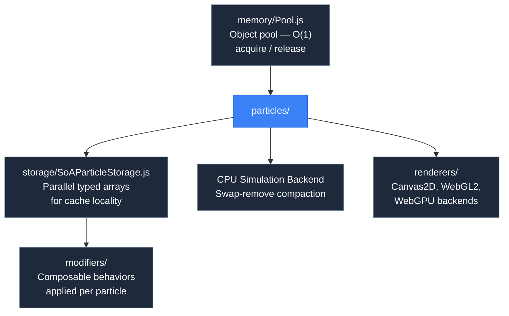

# 1.5 Why Architecture Matters


## Concept

Software architecture is the set of structural decisions that determine how a codebase handles change and scale. It is the answer to questions like: Where does new behavior go? How do modules communicate? What happens when data volume grows by 10x?

In game engines, architecture decisions have measurable, concrete consequences — frame rate, memory usage, battery drain, and development velocity.

## Problem

Two implementations of the same feature can differ by orders of magnitude in performance. The difference is entirely architectural.

Consider updating 10,000 particles. Both approaches below produce the same visual result. One sustains 60 FPS. The other stutters at 2,000 particles.

The difference is invisible when the particle count is low. At 100 particles, both run at 60 FPS. The problem only appears at scale — and by then, fixing it means rewriting the system.

Architecture problems compound over time:


## Naive Implementation

The naive particle list:

```js
const particles = []

function spawnParticle(x, y) {
  particles.push({
    x, y,
    vx: (Math.random() - 0.5) * 200,
    vy: (Math.random() - 0.5) * 200,
    life: 1.0,
    r: Math.random() * 255
  })
}

function updateParticles(dt) {
  for (let i = particles.length - 1; i >= 0; i--) {
    const p = particles[i]
    p.life -= dt
    if (p.life <= 0) {
      particles.splice(i, 1)
      continue
    }
    p.x += p.vx * dt
    p.y += p.vy * dt
  }
}
```

This has three architectural problems:

1. **Allocation pressure.** Every `spawnParticle` call creates a new object. Every object must eventually be garbage-collected. At 100 particles per second, this is fine. At 10,000, garbage collection pauses the game.
2. **O(n) removal.** `splice(i, 1)` shifts every element after the removed index. Removing 100 dead particles per frame means copying thousands of array elements — O(n²) total.
3. **Cache-unfriendly layout.** Each particle object is allocated independently on the heap. Iterating the array jumps between memory locations. The CPU spends more time waiting for memory than processing particles.

## Engine Solution

jygame solves these with three architectural patterns.

**Object pooling.** Particles are pre-allocated in a fixed-size pool. Acquiring a particle is O(1) — pop from a free list. Releasing is O(1) — push back to the free list. No allocation, no garbage collection.

**Swap-remove compaction.** Instead of `splice`, dead particles are swapped to the end of the active array and the count is decremented. O(1) per removal. No array shifting.

**Structure of Arrays storage.** Particle fields are stored in parallel typed arrays — one `Float32Array` for x positions, another for y positions, another for life. The CPU reads them sequentially, filling cache lines with useful data instead of skipping between scattered objects.

These patterns are not jygame-specific. They are general solutions to the problems the naive approach creates. jygame's implementations are case studies.

## Code Walkthrough

The architecture is visible across several modules. Here is how they connect:



`memory/Pool.js` provides the base pool that particle systems use. It pre-allocates objects and reuses them, eliminating garbage collection.

`storage/SoAParticleStorage.js` stores particle data in parallel typed arrays. Each particle is not an object — it is an index into these arrays. Accessing particle 42 means reading `positions[42]`, `velocities[42]`, `life[42]` — contiguous memory, cache-friendly.

The modifier stack (`modifiers/`) lets you compose behaviors without writing new classes. A force modifier applies acceleration. A color modifier interpolates color. A scale modifier shrinks particles over time. They combine freely — no modifier knows about the others.

The renderer backends (`renderers/`) implement a common interface. The simulation code does not know whether it is drawing to a Canvas2D context, a WebGL2 buffer, or a WebGPU pass. The same particle data works with all three.

Each of these patterns is covered in depth in later chapters. The point here is the structure: the naive approach lumps everything into one array of objects. The engine approach separates concerns — memory management, data layout, behavior composition, and rendering — into independent modules that can be understood, tested, and optimized separately.

## Advanced

Architecture is not just about performance. It is about change.

Code that works stays working. The problem is the code that needs to change. New features, new requirements, new platforms, new performance targets. Architecture determines how painful those changes are.

Good architecture makes change manageable:

- Adding a new particle behavior? Create a new modifier. Do not modify existing code.
- Adding a new renderer? Implement the renderer interface. Do not touch the simulation.
- Scaling to more particles? Swap the backend from CPU to GPU compute. Do not rewrite the system.
- Porting to a new platform? The abstractions isolate platform-specific code.

Bad architecture makes every change a project:

- Adding a new behavior means adding parameters to existing functions, threading them through call chains, and updating every call site.
- Adding a new renderer means adding conditional branches throughout the simulation code.
- Scaling means rewriting.

The difference between good and bad architecture is not visible in the initial implementation. Both produce the same output. The difference appears over the lifetime of the project — in how many features you can add before the code becomes unmanageable.

This guide exists because architecture matters. Every chapter that follows is a case study in a specific architectural decision. The pool file exists because allocation matters. The SoA storage exists because cache misses matter. The modifier stack exists because composition beats inheritance. The GPU backend exists because parallelism is not optional at scale.

Each chapter teaches concept and code. When you finish, you will have a mental model of how a modern particle engine works — and you will be able to build one yourself. That understanding transfers. When you work with Unity, Unreal, Godot, or your own engine, the same principles apply. The engine changes. The architecture principles do not.
