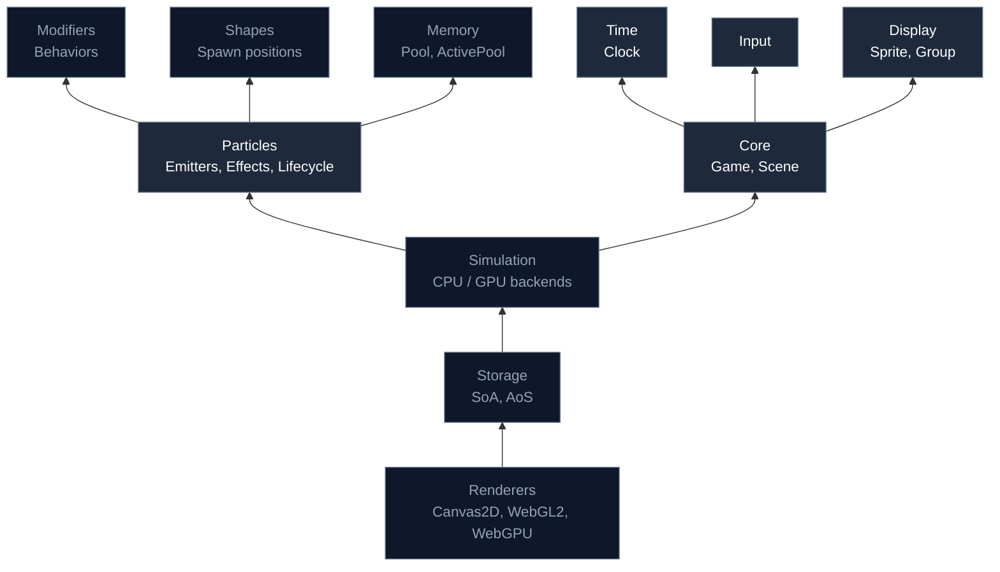

---
next:
  text: '2.1 Understanding Memory'
  link: '/2-memory/01-understanding-memory'
---

# 1.6 jygame's Architecture at a Glance

> This chapter is a reference map. Unlike the others, it does not follow the 6-layer teaching progression because its purpose is to survey and connect, not to derive. Every layer has been taught in chapters 1.1–1.5.

## The Module Map

jygame's source code is organized into directories by concern. Each directory contains files that contribute to a single architectural layer.

```mermaid
graph TD
    Entry["jygame.js<br/>Entry point — exports<br/>public API"] --> Core
    Entry --> Input
    Entry --> Display
    Entry --> Systems
    Entry --> Particles
    Entry --> Audio

    Core["core/<br/>Game, Scene"] --> Input["input/<br/>Input, InputContext"]

    Display["display/<br/>Sprite, Group,<br/>Camera, Layer"] --> Systems["systems/<br/>Movement, Render,<br/>Animation, Collision"]

    Display --> Components["components/<br/>Transform, Collider,<br/>Renderable, Animation"]

    Systems --> Components
    Systems --> Collision["collision/<br/>SpatialHash"]

    Particles --> Storage["storage/<br/>Particle storage<br/>(SoA, AoS, Accessors)"]
    Particles --> Modifiers["modifiers/<br/>Force, Color, Scale,<br/>Spawn, Collision, ..."]
    Particles --> Shapes["shapes/<br/>Circle, Rect, Cone,<br/>Ring, Polygon, ..."]
    Particles --> Memory["memory/<br/>Pool, ActivePool"]

    Particles --> RenderSim["CPU simulation<br/>& GPU simulation<br/>backends"]
    RenderSim --> Renderers["renderers/<br/>Canvas2D, WebGL2,<br/>WebGPU"]

    Audio["audio/<br/>Sound management"]
    Math["math/<br/>Vec2, Random,<br/>utilities"]
    Camera["camera/<br/>Viewport management"]
    Color["color/<br/>Color utilities"]
    Geometry["geometry/<br/>Geometric helpers"]
    Loaders["loaders/<br/>Asset loading"]
    State["state/<br/>State machines"]

    style Entry fill:#3b82f6,stroke:#2563eb,color:#fff
    style Core fill:#1e293b,stroke:#64748b,color:#fff
    style Input fill:#1e293b,stroke:#64748b,color:#fff
    style Display fill:#1e293b,stroke:#64748b,color:#fff
    style Systems fill:#1e293b,stroke:#64748b,color:#fff
    style Components fill:#1e293b,stroke:#64748b,color:#fff
    style Collision fill:#1e293b,stroke:#64748b,color:#fff
    style Particles fill:#1e293b,stroke:#64748b,color:#fff
    style Storage fill:#0f172a,stroke:#64748b,color:#94a3b8
    style Modifiers fill:#0f172a,stroke:#64748b,color:#94a3b8
    style Shapes fill:#0f172a,stroke:#64748b,color:#94a3b8
    style Memory fill:#0f172a,stroke:#64748b,color:#94a3b8
    style RenderSim fill:#0f172a,stroke:#64748b,color:#94a3b8
    style Renderers fill:#0f172a,stroke:#64748b,color:#94a3b8
    style Audio fill:#1e293b,stroke:#64748b,color:#fff
    style Math fill:#1e293b,stroke:#64748b,color:#fff
    style Camera fill:#1e293b,stroke:#64748b,color:#fff
    style Color fill:#1e293b,stroke:#64748b,color:#fff
    style Geometry fill:#1e293b,stroke:#64748b,color:#fff
    style Loaders fill:#1e293b,stroke:#64748b,color:#fff
    style State fill:#1e293b,stroke:#64748b,color:#fff
```

## Directory by Directory

### `core/` — Application Framework

| File | Lines | Responsibility |
|---|---|---|
| `Game.js` | 420 | Main loop, scene stack, canvas management, input wiring, pause/resume, viewport scaling |
| `Scene.js` | 82 | Lifecycle base class — `enter`, `exit`, `pause`, `resume`, `update`, `render`, `interpolate` |

`Game` is the top-level coordinator. It owns the clock, the scene stack, the canvas, input, and the RAF loop. `Scene` is the unit of gameplay — menus, gameplay, pause overlays are all scenes. The scene stack supports blocking (a pause scene can block the scene below from updating but not rendering).

### `time/` — Timing

| File | Lines | Responsibility |
|---|---|---|
| `Clock.js` | 51 | Fixed timestep accumulator, alpha for interpolation, spiral-of-death protection |

The clock is the engine's heartbeat. It converts real wall-clock time into fixed-size simulation steps.

### `input/` — Input

| File | Lines | Responsibility |
|---|---|---|
| `Input.js` | 160 | Keyboard, mouse, touch, gamepad. JustPressed/justReleased tracking, scoped to a container element |

Input is initialized on the game's container element, not the document, so input events are scoped to the game area.

### `display/` — Visual Objects

| File | Lines | Responsibility |
|---|---|---|
| `Sprite.js` | 43 | Convenience entity builder that composes Transform + Collider + Renderable + Animation |
| `Group.js` | 79 | Entity collection with collision queries and optional spatial hashing |
| `Layer.js` | — | Render layering with parallax |

Sprites are the primary way to create game objects. Groups organize them for system iteration and collision detection.

### `components/` — ECS Data

| File | Lines | Responsibility |
|---|---|---|
| `Transform.js` | 10 | Position, rotation, scale |
| `Collider.js` | 45 | AABB collision checks — `checkAABB`, `checkRect`, `containsPoint`, `getAABB` |
| `Renderable.js` | 44 | Draw method with shape caching (circle, rect, ellipse) and image rendering |
| `Animation.js` | 43 | Animation clip management — `add`, `play`, `pause`, `resume`, `stop`, `onComplete` |

Each component is a plain data class. No behavior, just fields and utility methods for field manipulation.

### `systems/` — ECS Behavior

| File | Lines | Responsibility |
|---|---|---|
| `MovementSystem.js` | 15 | Velocity * dt applied to position |
| `RenderSystem.js` | 91 | Camera-aware rendering with culling, transform save/restore |
| `AnimationSystem.js` | 43 | Frame-timed animation with looping and completion callbacks |
| `CollisionSystem.js` | 98 | Delegates to SpatialHash per group, falls back to brute-force AABB |

Systems are where the logic lives. Each system iterates over entities, checks for the required components, and processes them.

### `collision/` — Collision Detection

| File | Lines | Responsibility |
|---|---|---|
| `SpatialHash.js` | 140 | Spatial grid for broad-phase collision, rebuild, group-vs-group queries |

SpatialHash divides the world into a grid. Entities are assigned to grid cells. Collision checks only test entities in the same or adjacent cells instead of every entity against every other entity.

### `memory/` — Memory Management

| File | Lines | Responsibility |
|---|---|---|
| `Pool.js` | — | O(1) acquire/release object pool with free list |
| `ActivePool.js` | — | Pool that tracks active (in-use) objects for iteration |

Pools eliminate allocation and garbage collection by reusing object slots.

### `storage/` — Particle Data Layout

| File | Lines | Responsibility |
|---|---|---|
| Various | — | SoA (Structure of Arrays), AoS (Array of Structures), accessors, storage registry |

Storage modules control how particle data is laid out in memory. SoA stores fields in parallel typed arrays for cache-efficient iteration.

### `particles/` — Particle System

| File | Lines | Responsibility |
|---|---|---|
| Various | — | Particle lifecycle, emitters, effects, asset definitions, death sweep, sorting, CPU/GPU backends |

This is the largest subsystem. It coordinates emitters (which spawn particles), effects (which define appearances), modifiers (which alter particles over their lifetime), storage (which holds particle data), and simulation backends (CPU or GPU compute).

### `modifiers/` — Particle Behaviors

| File | Lines | Responsibility |
|---|---|---|
| Various | — | Force, Color, Scale, Alpha, Rotation, Spawn, Collision, Attractor, Vortex, and more |

Modifiers are composable behavior units. Each modifier implements a contract (`init`, `update`, `draw`) and is applied to particles by the simulation backend. Modifiers can be combined freely to create complex effects without writing new code.

### `shapes/` — Emitter Shapes

| File | Lines | Responsibility |
|---|---|---|
| Various | — | Circle, Rectangle, Cone, Ring, Polygon, Path, Spline, Direction vectors |

Shapes control where particles spawn. An emitter with a Circle shape spawns particles within a circular area. A Cone shape spawns particles in a directional cone.

### `renderers/` — Rendering Backends

| File | Lines | Responsibility |
|---|---|---|
| Various | — | Canvas2D, WebGL2 instanced, WebGPU compute renderers |

Each renderer implements the same interface. The particle simulation feeds data to the renderer, which draws it using the appropriate API. Switching from Canvas2D to WebGL2 requires no changes to simulation code.

### `math/`, `color/`, `geometry/`, `camera/`, `loaders/`, `audio/`, `state/` — Utilities

Support modules providing vector math, color space conversions, geometric calculations, viewport management, asset loading, audio playback, and state machine infrastructure.

## Dependency Direction

Lower layers do not import from higher layers. Core does not import from Particles. Particles does not import from Renderers — it delegates through an interface. This ensures modules can be understood and tested in isolation.

The dependency stack from bottom to top:

## What Each Part of This Guide Covers

| Part | Topic | Key Modules |
|---|---|---|
| 0 | Welcome | — |
| 1 | Foundations | Core, Time, Display, Components, Systems |
| 2 | Memory Management | `memory/` |
| 3 | Particles | `particles/` |
| 4 | Modifiers | `modifiers/` |
| 5 | Shapes | `shapes/` |
| 6 | Storage Architectures | `storage/` |
| 7 | CPU Simulation | `particles/` (CPU backend) |
| 8 | GPU Simulation | `particles/` (GPU backend) |
| 9 | WebGPU | `renderers/`, WGSL shaders |
| 10 | WASM & SIMD | `particles/` (WASM death sweep) |
| 11 | Rendering | `renderers/` |
| 12 | Full Walkthrough | All modules |

Each chapter in those parts builds on the foundations established here. When you encounter a reference to a module or file, return to this map to see where it fits in the overall architecture.
