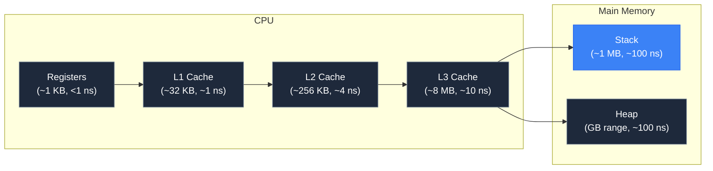

---
prev:
  text: "1.6 jygame's Architecture at a Glance"
  link: '/1-foundations/06-jygame-architecture-at-a-glance'
---

# 2.1 Understanding Memory

## Concept

Every program uses memory to store data — variables, objects, arrays, function call frames. How that memory is organized and reclaimed determines how fast your program runs and whether it stutters.

Modern computers have a memory hierarchy. The **stack** is a small, fast region where function calls and local variables live. The **heap** is a large region where objects and dynamic allocations live. A **garbage collector (GC)** is the automatic memory manager that reclaims heap memory no longer in use.



The stack is a LIFO (last in, first out) structure. When a function is called, a new frame is pushed. When it returns, the frame is popped. Local variables within that frame disappear instantly. No cleanup needed, no fragmentation — just move the stack pointer.

The heap is different. Objects allocated on the heap can live beyond the function that created them. They persist until nothing references them. The garbage collector must periodically scan the heap to find unreachable objects and free their memory.

## Problem

When a game allocates and discards objects on the heap every frame, the garbage collector must eventually run. A GC scan pauses JavaScript execution. On a modern V8 engine, a minor GC pause is a few milliseconds. A major GC pause can be tens of milliseconds — multiple frame budgets at 60 FPS.

Consider a particle system that creates 1000 particle objects per second. After a few seconds, thousands of dead particle objects litter the heap. The GC must find them, mark them as unreachable, and reclaim their memory. While it does this, the game does not update or render.

This is the fundamental problem: **allocation is not free, and its cleanup cost is unpredictable**.

## Naive Implementation

JavaScript abstracts memory management entirely. You create objects and the engine handles the rest:

```js
function spawnParticle() {
  return {
    x: 0, y: 0,
    vx: 0, vy: 0,
    life: 1.0,
    r: 255, g: 0, b: 0
  }
}
```

There is no `free()` call. There is no destructor. The engine allocates the object on the heap. When the particle dies and the reference is lost, the object becomes garbage — a future GC responsibility.

This works until it does not. The problem is not a single allocation. The problem is sustained allocation at game framerates. The GC runs when it decides to, not when you decide to. This unpredictability is the enemy of smooth frame rendering.

## Engine Solution

jygame avoids heap allocation on the hot path by pre-allocating memory and reusing slots. The `Pool` class (`memory/Pool.js`) manages a free list of pre-created objects. Instead of `new Particle()`, you call `pool.acquire()`. Instead of letting the object become garbage, you call `pool.release(obj)`.

This shifts the memory model from allocate-free-collect to acquire-release-reuse. No GC pressure, no pause, no unpredictability.

## Code Walkthrough

`memory/Pool.js:21`

The `acquire()` method either returns a recycled object or creates a new one:

```js
acquire(...args) {
  if (this._pool.length > 0) {
    const obj = this._pool.pop()
    obj.__jygamePooled = false
    return obj
  }
  this._capacity++
  return this._create(...args)
}
```

The `_pool` array is the free list. When objects are released, they are pushed back onto this array. When the pool is empty, a new object is created via the factory function. The maximum number of objects ever created is tracked by `_capacity`.

`memory/Pool.js:31`

The `release()` method resets the object and returns it to the free list:

```js
release(obj) {
  if (obj.__jygamePooled) return
  if (this._pool.length >= this._maxSize) return
  this._reset(obj)
  obj.__jygamePooled = true
  this._pool.push(obj)
}
```

The `__jygamePooled` flag prevents double-release. The `_maxSize` cap prevents the pool from growing unbounded. The reset function restores the object to its default state so the next acquirer gets a clean instance.

## Advanced

The stack and heap have different characteristics beyond speed:

- **Stack allocations are always LIFO.** You cannot keep a stack-allocated value after its function returns. This makes stack unsuitable for data with dynamic lifetimes.
- **Heap allocations can fragment.** Over time, allocated and freed objects leave holes in the heap. The allocator must find contiguous free space, which becomes slower as fragmentation increases.
- **GC is generational.** V8 divides the heap into young and old generations. Most objects die young, so V8 optimizes for fast minor GCs that only scan the young generation. Objects that survive multiple GCs are promoted to the old generation, which is collected less frequently but at higher cost.

JavaScript's hidden class system also affects memory. V8 creates hidden classes (maps) for object shapes. Two objects with the same property names share a hidden class, saving memory. Adding properties dynamically creates new classes and deoptimizes access. This is why jygame's pool reset function restores objects to a consistent shape — it preserves hidden class sharing.
