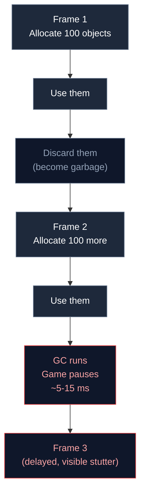

# 2.2 The Problem with Allocation

## Concept

Allocation is the act of reserving memory for a new value. In JavaScript, every object literal, array, function, or class instance allocates memory on the heap. Every string concatenation allocates. Every closure captures its environment, allocating.

These allocations are not free. They take time to set up, they consume memory bandwidth, and they eventually trigger garbage collection.

The problem is not a single allocation. The problem is **allocation rate** — how much memory you allocate per unit of time. A game loop that allocates memory every frame creates a continuous stream of garbage. The garbage collector must keep up.



## Problem

Allocation causes three distinct classes of problems:

**Allocation pressure.** The CPU must find free memory, update allocation tracking, and zero the memory. This takes time. At high allocation rates, the allocator becomes a bottleneck. V8's allocator is fast, but it is not instantaneous.

**GC pauses.** The garbage collector must traverse the object graph to find unreachable objects, mark them, sweep them, and optionally compact memory. During this time, JavaScript execution stops. A minor GC (young generation) takes 1-5 ms. A major GC (old generation) can take 20-50 ms. At 60 FPS, each frame budget is 16.67 ms. A major GC pause can drop multiple frames.

**Cache misses.** Objects allocated at different times end up at different memory addresses. Iterating an array of objects means the CPU jumps between memory locations. Each jump may miss the CPU cache, forcing a wait for main memory. This is 10-100x slower than accessing sequential memory.

## Naive Implementation

The classic example is per-frame string building for game UI:

```js
function renderHUD(ctx, score, fps) {
  const text = "Score: " + score + "  FPS: " + fps
  ctx.fillText(text, 10, 30)
}
```

Each frame creates a new string. Strings in JavaScript are immutable, so concatenation allocates a new string and discards the old one. Over one minute at 60 FPS, this allocates 3600 strings. Over an hour, 216,000 strings. Each allocation is tiny. The cumulative effect is not.

A more critical example is per-frame particle allocation:

```js
function updateParticles(dt) {
  for (let i = 0; i < particles.length; i++) {
    const p = particles[i]
    p.life -= dt
    if (p.life <= 0) {
      particles.splice(i, 1)
      i--
    }
  }
}

function spawnBurst(count) {
  for (let i = 0; i < count; i++) {
    particles.push({
      x: 0, y: 0,
      vx: Math.random() * 200 - 100,
      vy: Math.random() * 200 - 100,
      life: 1.0
    })
  }
}
```

`spawnBurst(100)` allocates 100 objects. The loop discards them via `splice`, which shifts array elements and creates array index gaps. The GC sees dead objects accumulating. At 100 particles per frame, the GC runs every few seconds, causing visible stutter.

## Engine Solution

jygame avoids these problems by eliminating allocation on the hot path. The patterns used:

**Object pooling.** All particle objects are pre-allocated. Acquiring a particle reuses an existing slot. Releasing returns it to a free list. No allocation, no garbage.

**Typed arrays for particle data.** Particles use `Float32Array` for position, velocity, and life fields. Typed arrays are allocated once and reused. They are not garbage-collected per element.

**Swap-remove for compaction.** Instead of `splice`, dead particles are swapped to the end of the array and the count is decremented. No array shifting, no element copying, no garbage.

**Pre-allocated output arrays.** Functions that return arrays accept an `out` parameter — the caller provides the array, the function fills it. No new array per call.

## Code Walkthrough

While the allocation problem is solved across multiple files, the core memory management module is `memory/Pool.js`.

`memory/Pool.js:21`

The pool's `acquire()` avoids allocation by checking the free list first:

```js
acquire(...args) {
  if (this._pool.length > 0) {
    const obj = this._pool.pop()
    obj.__jygamePooled = false
    return obj
  }
  this._capacity++
  return this._create(...args)
}
```

The `_pool` array stores released objects. Popping from the end is O(1) and does not cause allocation. Only when the pool is empty does `acquire()` call the factory function, which is the only allocation path.

`memory/Pool.js:31`

`release()` avoids deallocation. Instead of letting the object become garbage, it resets it and stores it for reuse:

```js
release(obj) {
  if (obj.__jygamePooled) return
  if (this._pool.length >= this._maxSize) return
  this._reset(obj)
  obj.__jygamePooled = true
  this._pool.push(obj)
}
```

The reset function restores the object to a clean state. The `_maxSize` cap prevents the pool from growing without bounds. If the free list is full, the object is allowed to become garbage — the pool sheds excess capacity gracefully.

## Advanced

Allocation-related problems are not limited to objects. Hidden costs include:

- **Boxing.** Primitive values (numbers, booleans) stored in arrays or object properties may be boxed into heap-allocated wrappers. V8 optimizes this in many cases (Smis, tagged pointers), but type instability can cause deoptimization.
- **Closure allocation.** Every closure captures its lexical environment. If a closure is created inside a hot loop, each iteration allocates a new closure object. Assign the closure to a variable outside the loop to reuse it.
- **Hidden class transitions.** Adding a property to an object after creation triggers a hidden class change (V8 calls this a "map transition"). The object's property access becomes slower. The pool's reset function is designed to restore properties in the same order, maintaining the same hidden class for all pooled objects.
- **Array deoptimization.** Storing mixed types in an array causes V8 to deoptimize from a specialized representation (e.g., `PACKED_SMI_ELEMENTS`) to a generic one. Particle storage uses typed arrays (`Float32Array`) specifically to avoid this.
