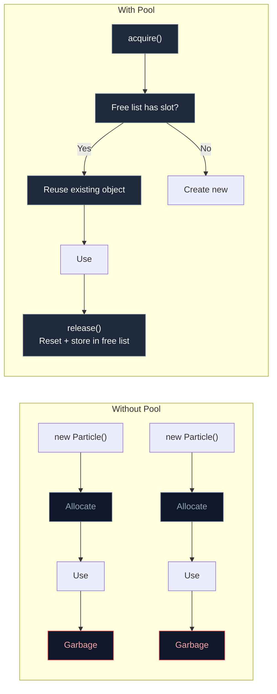

# 2.3 Object Pooling

## Concept

<ArrowPoolDemo />

**Object pooling** is a design pattern that reuses objects instead of creating and destroying them repeatedly.

A **pool** is a collection of pre-allocated objects. Instead of calling `new`, you **acquire** an object from the pool. Instead of letting the object become garbage, you **release** it back to the pool. The pool holds released objects in a **free list** — a structure that tracks which slots are available for reuse.



## Problem

When objects are created and discarded at high frequency, two things happen:

1. The allocator must repeatedly find and reserve memory, which takes CPU time
2. The garbage collector must eventually run to reclaim that memory, which pauses execution

Both problems scale with the number of objects created per frame. A particle system creating 10,000 particles per second creates 10,000 objects for the GC to clean up. The GC runs more frequently and pauses for longer.

The solution is to stop creating and destroying objects. Keep them alive and reuse them.

## Naive Implementation

Without a pool, every particle spawn is a new object and every death is a lost reference:

```js
const particles = []

function spawn(x, y) {
  particles.push({
    x, y,
    vx: Math.random() * 200,
    vy: Math.random() * 200,
    life: 2.0
  })
}

function update(dt) {
  for (let i = particles.length - 1; i >= 0; i--) {
    const p = particles[i]
    p.life -= dt
    if (p.life <= 0) {
      particles.splice(i, 1)
    } else {
      p.x += p.vx * dt
      p.y += p.vy * dt
    }
  }
}
```

Every call to `spawn` allocates. Every call to `splice` removes the element but the object it referenced lives on until the next GC. Over 10 seconds at 60 FPS with 100 particles per spawn, this creates 60,000 objects. The GC runs multiple times, causing stutter.

## Engine Solution

An object pool replaces `new` with `acquire` and garbage with `release`. The pattern is always the same:

1. **Pre-allocate** a number of objects upfront
2. **Acquire** returns a ready-to-use object from the free list
3. **Release** resets and returns the object to the free list
4. The free list grows only when the pool runs empty and shrinks only when the cap is reached

jygame's `Pool` class implements exactly this. It is generic — it works with any object type, requiring only a `create` factory and an optional `reset` function.

<SparkleExplosion />

## Code Walkthrough

`memory/Pool.js:1`

The constructor accepts three configuration options:

```js
constructor({ create, reset, initialSize = 0, maxSize = Infinity } = {}) {
  if (typeof create !== "function") {
    throw new Error("Pool requires a `create` factory function")
  }
  this._create = create
  this._reset = typeof reset === "function" ? reset : () => {}
  this._maxSize = maxSize
  this._pool = []
  this._capacity = 0

  if (initialSize > 0) {
    this.grow(initialSize)
  }
}
```

`create` is required — the pool must know how to make new objects. `reset` is optional — if omitted, objects are returned to the free list as-is. `initialSize` pre-warms the pool so the first N acquires do not allocate. `maxSize` prevents unbounded growth.

`memory/Pool.js:49`

The `grow()` method pre-allocates N objects and adds them to the free list:

```js
grow(n) {
  for (let i = 0; i < n; i++) {
    const obj = this._create()
    this._reset(obj)
    obj.__jygamePooled = true
    this._pool.push(obj)
  }
  this._capacity += n
}
```

Each created object is immediately reset and flagged as pooled. These objects sit in the free list until an `acquire()` call picks them up. Pre-warming ensures that the hot path never hits the allocator.

`memory/Pool.js:21`

The `acquire()` method is the hot path. It first tries the free list before falling back to creation:

```js
acquire(...args) {
  if (this._pool.length > 0) {
    const obj = this._pool.pop()
    obj.__jygamePooled = false
    return obj
  }
  this._capacity++
  return this._create(...args)
}
```

`memory/Pool.js:31`

The `release()` method resets and stores:

```js
release(obj) {
  if (obj.__jygamePooled) return
  if (this._pool.length >= this._maxSize) return
  this._reset(obj)
  obj.__jygamePooled = true
  this._pool.push(obj)
}
```

Both acquire and release are O(1) — `pop` and `push` on a JavaScript array. The `__jygamePooled` flag prevents double-release, which would corrupt the free list.

## Advanced

Object pooling is not free. It introduces tradeoffs:

**Memory overhead.** Pooled objects sit in memory whether they are in use or not. A pool sized for the worst case (10,000 particles) holds 10,000 objects permanently. If the number of active particles is usually 100, the pool wastes memory for 9,900 objects. The solution is `maxSize` — the pool sheds excess when the free list exceeds the cap.

**Reset cost.** Every released object must be reset to a clean state. If reset is expensive (iterating nested properties, resetting arrays), it can dominate the cost of release. The reset function should be as cheap as possible — assigning primitives, not allocating.

**Complexity.** Pooling adds code and a concept the reader must understand. For small-scale use (dozens of objects, not thousands), pooling is unnecessary. The convention is: pool everything on the hot path, pool nothing on the cold path.

**Hidden class preservation.** V8 optimizes objects that share the same hidden class (property layout). The reset function should restore properties in the same order they were created, preserving the hidden class for all pooled objects. A reset that adds properties in a different order creates a new hidden class, defeating the optimization.
