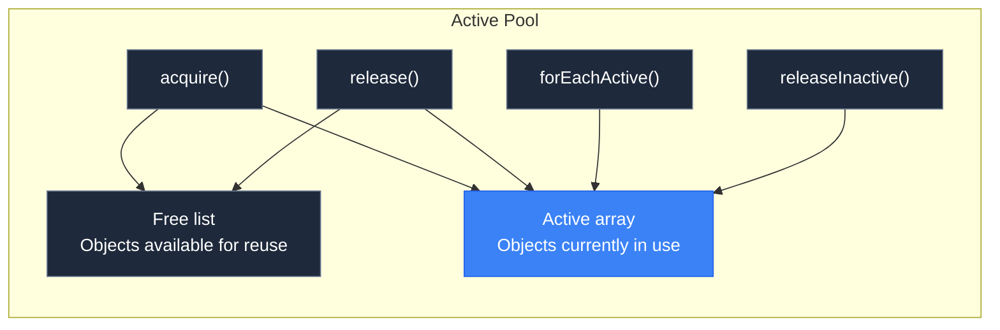
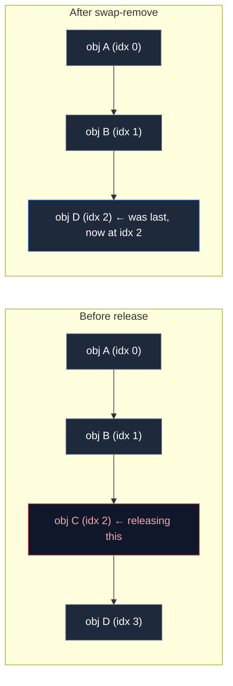

# 2.4 Active Pools

## Concept

An **active pool** is a pool that tracks which objects are currently in use (active). Unlike a simple free-list pool, an active pool maintains a separate array of active objects in addition to the free list.

This enables three things the simple pool cannot do:

1. **Iterate all active objects** — update particle positions, render sprites, check collisions
2. **Count active objects** — measure pool pressure, detect leaks, report statistics
3. **Batch-release by predicate** — release all dead particles without per-object tracking

The active array gives the pool visibility into the in-use state, at the cost of additional bookkeeping on acquire and release.




## Problem

A particle system without active tracking must maintain a separate array of active particles:

```js
const freeParticles = []
const activeParticles = []

function acquire() {
  if (freeParticles.length > 0) {
    const p = freeParticles.pop()
    activeParticles.push(p)
    return p
  }
  const p = createParticle()
  activeParticles.push(p)
  return p
}

function release(p) {
  const idx = activeParticles.indexOf(p)
  if (idx !== -1) activeParticles.splice(idx, 1)
  freeParticles.push(p)
}
```

This duplicates array management across every system that uses pools. The `indexOf` + `splice` pattern is O(n) per release — slow at scale. Every pool user must implement the same tracking logic, with the same bugs.

## Naive Implementation

The naive active-tracking approach uses `indexOf` to find an object and `splice` to remove it:

```js
release(obj) {
  const idx = this._active.indexOf(obj)
  if (idx === -1) return
  this._active.splice(idx, 1)
  this._free.push(obj)
}
```

`indexOf` scans the entire active array — O(n). `splice` shifts every element after the removed index — O(n). For 10,000 active particles, releasing one particle scans up to 10,000 elements and shifts up to 9,999 elements.

The failure mode: releasing N particles per frame becomes O(n²) total, overwhelming the frame budget at high particle counts.

## Engine Solution

jygame's active pool solves O(1) release with two techniques:

**Index tracking.** Each active object stores its own index in the active array via `__jygamePoolIndex`. When `acquire()` pushes a new object, it sets `obj.__jygamePoolIndex = this._active.length - 1`. This eliminates the `indexOf` scan.

**Swap-remove.** Instead of `splice`, the active pools uses **swap-remove**: the last element in the array is swapped into the removed slot, and the array length is decremented. This is O(1) — no shifting.



## Code Walkthrough

The active pool pattern is implemented in `memory/ActivePool.js`. The core release logic:

```js
release(obj) {
  if (!obj.__jygamePoolActive) return false

  const idx = obj.__jygamePoolIndex
  if (idx < 0 || idx >= this._active.length || this._active[idx] !== obj) {
    return false
  }

  const last = this._active.pop()
  if (idx < this._active.length) {
    this._active[idx] = last
    last.__jygamePoolIndex = idx
  }

  obj.__jygamePoolActive = false
  obj.__jygamePoolIndex = -1
  this._pool.release(obj)
  return true
}
```

The sanity check (`this._active[idx] !== obj`) catches corrupted state — if the index and the object do not match, something went wrong upstream. The swap-remove handles the case where the object being released is already the last element (no swap needed, just pop).

`acquire()` sets up the tracking:

```js
acquire(...args) {
  const beforeFree = this._pool.size
  const obj = this._pool.acquire(...args)
  if (this._pool.size >= beforeFree) {
    this._totalCreated++
  }
  obj.__jygamePoolActive = true
  obj.__jygamePoolIndex = this._active.length
  this._active.push(obj)
  if (this._active.length > this._peakActive) {
    this._peakActive = this._active.length
  }
  return obj
}
```

The index is set to `this._active.length` before push, which is the index the new object will occupy. After push, the object is at that index.

## Advanced

Swap-remove does not preserve ordering. If the active array order matters (e.g., render order by insertion), swap-remove destroys it. For particle systems, ordering usually does not matter, making swap-remove ideal. If order matters, you must use `splice` and accept the O(n) cost, or use a different data structure (linked list, ordered array with a tombstone).

Active pools also enable **batch operations**:

- `acquireMany(count)` calls `acquire()` N times and optionally initializes each object via a callback
- `releaseMany(objects)` calls `release()` on each object in an iterable
- `releaseInactive(predicate)` iterates backward and releases objects that match the predicate, using swap-remove for each match
- `clearActive()` releases every active object in one pass, then sets `active.length = 0`

The `releaseInactive` backward iteration is important for correctness — removing an element shifts subsequent indices. By iterating backward, the swap-remove only touches elements that have already been checked.
