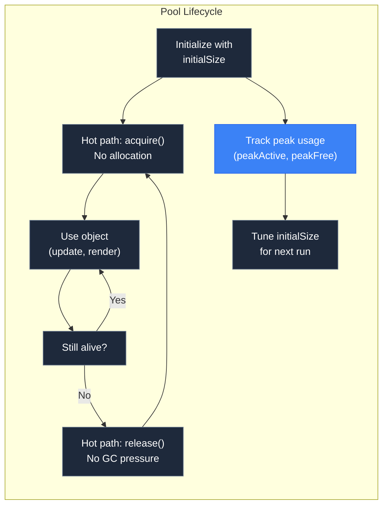

---
next:
  text: '3.1 What is a Particle?'
  link: '/3-particles/01-what-is-a-particle'
---

# 2.5 Pooling in Practice

## Concept

Knowing how a pool works is not the same as knowing how to use one effectively. Pool sizing, warmup, peak tracking, and lifecycle management are practical skills that determine whether a pool improves performance or wastes memory.

This chapter covers the patterns and heuristics for using pools in real systems.



## Problem

A pool without sizing discipline causes one of two problems:

**Under-allocation.** The pool has too few pre-allocated objects. Every new particle beyond the initial size triggers `create()`, which allocates. The pool becomes a slow path disguised as a fast path, because most acquires hit the allocator.

**Over-allocation.** The pool pre-allocates 10,000 objects but the game never uses more than 100. 9,900 objects sit in the free list consuming memory. The pool wastes RAM and increases page fault risk.

Warmup and peak tracking are the tools that balance these extremes.

## Naive Implementation

A pool used without warmup or sizing:

```js
const particlePool = new ActivePool({
  create: () => new Particle(),
  initialSize: 0
})

function spawnBurst(count) {
  for (let i = 0; i < count; i++) {
    const p = particlePool.acquire()
    initParticle(p)
  }
}
```

With `initialSize: 0`, the first N particle bursts hit the allocator. The pool creates objects on the hot path — exactly what pooling is supposed to prevent.

The fix is to warmup the pool to the expected peak count:

```js
const PEAK_PARTICLES = 5000
particlePool.warmup(PEAK_PARTICLES)
```

Now the first 5000 acquires reuse pre-allocated objects. No allocation on the hot path.

## Engine Solution

`ActivePool` tracks peak statistics to guide sizing decisions. After running the game through a representative scene, you inspect `peakActive` and `peakCapacity` to determine the correct warmup value.

```js
console.log("Peak active:", pool.peakActive)
console.log("Peak capacity:", pool.peakCapacity)
console.log("Peak free:", pool.peakFree)
```

These values tell you:

- `peakActive` — the maximum number of objects simultaneously in use. This is your minimum warmup target.
- `peakFree` — the maximum number of objects sitting in the free list. This tells you how much headroom the pool maintained. A large `peakFree` relative to `peakActive` means you over-allocated.
- `peakCapacity` — the maximum total objects ever managed (active + free). This is your upper bound for memory budgeting.

## Code Walkthrough

`memory/ActivePool.js:50`

The peak tracking getters expose the statistics:

```js
get peakActive() {
  return this._peakActive
}

get peakCapacity() {
  return this._peakCapacity
}

get peakFree() {
  return this._peakFree
}
```

These are updated in `acquire()` (peakActive, peakCapacity) and `release()` (peakFree). After a scene runs, reading these values provides the data needed to tune the pool.

`memory/ActivePool.js:229`

The warmup method pre-allocates objects:

```js
warmup(count) {
  this._pool.grow(count)
  this._totalCreated += count
  const cap = this.capacity
  if (cap > this._peakCapacity) this._peakCapacity = cap
  if (this.freeCount > this._peakFree) this._peakFree = this.freeCount
}
```

Warmup calls `grow()` on the underlying pool, which creates `count` objects and pushes them onto the free list. These objects are immediately available for `acquire()`.

## Pooling Patterns

### Scene Lifecycle

Create pools when a scene loads, drain them when the scene exits. This prevents memory from accumulating across scenes.

```js
class GameScene extends Scene {
  enter() {
    this.particlePool = new ActivePool({
      create: () => new Particle(),
      initialSize: 5000
    })
  }

  exit() {
    this.particlePool.clearActive()
    // Pool is discarded when scene exits;
    // objects become garbage naturally
  }
}
```

### Pool Sizing Heuristic

Set `initialSize` to 120% of the expected peak to provide headroom. Use `peakActive` from the previous run to calibrate.

```
initialSize = Math.ceil(expectedPeak * 1.2)
```

If the pool's `capacity` reaches `initialSize` during gameplay, increase the warmup for the next session.

### Pool per Object Type

Do not share pools between unrelated object types. A pool of particles and a pool of sprites should be separate instances. Mixing them makes tracking and sizing impossible.

```js
const particlePool = new ActivePool({ create: () => new Particle() })
const spritePool = new ActivePool({ create: () => new Sprite() })
```

### Max Size for Memory Budget

Use `maxSize` to cap total memory. If the game budget allows 10,000 particles maximum, set `maxSize: 10000` on the pool. Excess releases are discarded rather than accumulated.

```js
const particlePool = new ActivePool({
  create: () => new Particle(),
  maxSize: 10000
})
```

### Batch Acquire for Bursts

When spawning a burst of particles, use `acquireMany` instead of a loop of `acquire` calls. The performance difference is negligible with V8's optimizer, but the intent is clearer:

```js
const burst = particlePool.acquireMany(100, null, (p, i) => {
  p.x = originX
  p.y = originY
  p.vx = Math.cos(angle + i * step) * speed
  p.vy = Math.sin(angle + i * step) * speed
})
```

## Advanced

Pooling is not always the right answer. Consider these scenarios:

**Not on the hot path.** If a function is called once per level load, not every frame, allocation is fine. Pooling adds complexity with no benefit.

**Small, fixed-count objects.** If the maximum number of objects is known at compile time and never changes, a fixed array is simpler and faster than a pool.

**GPU-resident data.** For WebGPU compute shaders, particle data lives in GPU buffers, not JS objects. Pooling JS objects is irrelevant. The storage buffer handles reuse.

**Read-only data.** If objects are never modified after creation, allocation at load time is acceptable. The objects persist for the scene lifetime and are freed when the scene unloads.

The general principle: pool objects on the frame-rate-critical path. Do not pool objects that are created and used outside the hot loop. The distinction between hot and cold paths is the same distinction that determines whether allocation matters.
