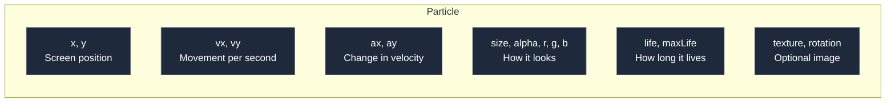

---
prev:
  text: '2.5 Pooling in Practice'
  link: '/2-memory/07-pooling-in-practice'
next:
  text: '3.2 What is a Particle System?'
  link: '/3-particles/02-particle-system'
---

# 3.1 What is a Particle?

## Concept

A **particle** is the smallest unit in a particle system. It represents a single visual element — a spark, a snowflake, a drop of rain, a fragment of an explosion. Particles are not tied to game logic; they are ephemeral, short-lived objects that exist only to produce a visual effect.

Every particle has a set of properties that define its appearance and behavior:



A particle is not a game entity. It does not have collision, AI, or persistence. It is born, it moves, it fades, and it dies. The only purpose of a particle is to be visible for a short time.

## Properties

| Property | Type | Purpose |
|---|---|---|
| `x`, `y` | number | Current position |
| `vx`, `vy` | number | Velocity in pixels per second |
| `ax`, `ay` | number | Acceleration in pixels per second² |
| `life` | number | Remaining lifetime in seconds |
| `maxLife` | number | Initial lifetime (for computing age ratio) |
| `size` | number | Radius or scale of the particle |
| `alpha` | number | Opacity (0 = invisible, 1 = opaque) |
| `r`, `g`, `b` | number 0–255 | Color channels |
| `texture` | Image | Optional sprite texture |
| `rotation` | number | Angle in radians |

Every frame, the system integrates these values: position changes by velocity times delta time, velocity changes by acceleration, life decreases. When `life` reaches zero, the particle dies.

## Naive Representation

The simplest way to represent a particle is a plain object:

```js
const particle = {
  x: 100, y: 200,
  vx: 50, vy: -100,
  life: 2.0,
  maxLife: 2.0,
  size: 4,
  alpha: 1,
  r: 255, g: 200, b: 100,
}
```

This is readable, flexible, and works for a handful of particles. The problem is that thousands of plain objects create GC pressure (Chapter 2.2). jygame addresses this with storage backends (covered in Part 6), but the particle *interface* stays the same.

## Engine Representation

`display/Particle.js:1`

jygame defines a `Particle` class with every property pre-declared in the constructor:

```js
export class Particle {
  constructor() {
    this.x = 0;    this.y = 0;
    this.vx = 0;   this.vy = 0;
    this.ax = 0;   this.ay = 0;
    this.life = 0; this.maxLife = 0;
    this.size = 1;
    this.rotation = 0;
    this.alpha = 1;
    this.r = 255;  this.g = 255;  this.b = 255;
    this.texture = null;
    // …
  }
}
```

Every property is initialized to a default. When the storage reset function runs, it restores all properties to these defaults, ensuring recycled particles start clean.

The class also provides convenience helpers:

```js
get lifeRatio() {
  return this.maxLife > 0
    ? this.life / this.maxLife
    : 0
}
```

`lifeRatio` goes from 1 (just born) to 0 (about to die). Modifiers use it to interpolate colors, sizes, and alpha over the particle's lifetime.

## Advanced

Particles are often stored in **SoA (Struct of Arrays)** layout rather than as individual objects. SoA stores each property in a separate typed array (`_x`, `_y`, `_vx`, `_vy`, …). This gives better cache locality when iterating — all x values are contiguous in memory.

Even with SoA storage, the particle accessor object presents the same interface. The code that reads `p.x` and writes `p.y` does not change. The storage backend handles the translation transparently (covered in Part 6).
