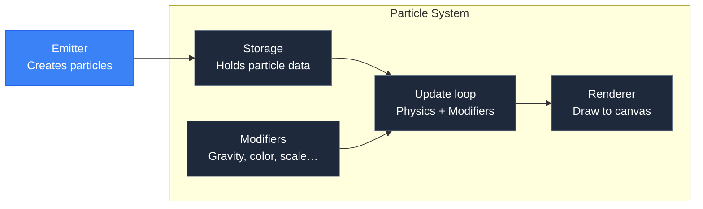

---
prev:
  text: '2.5 Pooling in Practice'
  link: '/2-memory/07-pooling-in-practice'
---

# 3.2 What is a Particle System?

## Concept

A **particle system** manages a collection of particles through their lifecycle. It owns the storage, runs the update loop, and renders every particle every frame.

The responsibility of a particle system is:



The system does not create particles directly. An **emitter** (Chapter 3.5) sends particles into the system. The system stores them, updates them, and draws them.

## Problem

Without a system, you manage particles manually:

```js
const activeParticles = []
const freeParticles = []

function spawn(x, y) {
  let p
  if (freeParticles.length > 0) {
    p = freeParticles.pop()
  } else {
    p = { x: 0, y: 0, vx: 0, vy: 0, life: 0, … }
  }
  p.x = x; p.y = y
  p.life = 2.0
  activeParticles.push(p)
}

function update(dt) {
  for (let i = activeParticles.length - 1; i >= 0; i--) {
    const p = activeParticles[i]
    p.x += p.vx * dt
    p.y += p.vy * dt
    p.life -= dt
    if (p.life <= 0) {
      activeParticles.splice(i, 1)
      freeParticles.push(p)
    }
  }
}
```

This works for one type of particle. For multiple effects — rain + explosions + trails — you duplicate the pool, the loop, the render. Every system reimplements the same pattern with different bugs.

## Naive Integration

The naive fix is a class:

```js
class ParticleSystem {
  constructor() {
    this._particles = []
    this._free = []
  }

  emit(count, init) { … }
  update(dt) { … }
  render(ctx) { … }
}
```

This centralizes storage and the loop, but it still uses plain objects (`new` on spawn), still hits the GC, and still uses `splice` on death. The structure is right; the implementation is wrong.

## Engine Solution

`particles/ParticleSystem.js:1`

jygame's `ParticleSystem` is a thin facade that delegates to a **backend**:

```js
export class ParticleSystem {
  constructor({ renderParticle, renderer, backend, storage } = {}) {
    this._backend = backend || new CpuParticleBackend({
      renderParticle, renderer, system: this, storage
    })
  }
}
```

The backend handles storage, modifiers, sorting, and rendering. There are two backends:

| Backend | File | Purpose |
|---|---|---|
| `CpuParticleBackend` | `particles/backends/CpuParticleBackend.js` | CPU-based simulation, **default** |
| `GpuParticleBackend` | `particles/backends/GpuParticleBackend.js` | WebGPU compute shader simulation |

The system exposes a consistent API regardless of backend:

```js
system.emit(count, initializer)  // Spawn particles
system.update(dt)                // Advance simulation
system.render(ctx)               // Draw to canvas
system.clear()                   // Remove all particles
```

## Code Walkthrough

`particles/ParticleSystem.js:10`

Adding modifiers:

```js
addModifier(modifier, priority) {
  this._backend.addModifier(modifier, priority)
}
```

Modifiers are plugins that run every frame: gravity, color over lifetime, scale over lifetime, turbulence. They are the subject of Part 4.

`particles/ParticleSystem.js:90`

Statistics and introspection:

```js
get activeCount() { return this._backend.activeCount }
get freeCount()   { return this._backend.freeCount }
get capacity()    { return this._backend.capacity }
get peakActive()  { return this._backend.peakActive }
get particles()   { return this._backend.particles }
```

These give visibility into the system's state at any time.

`particles/ParticleSystem.js:130`

Sorting is exposed directly:

```js
get sortMode()        { return this._backend.sortMode }
set sortMode(value)   { this._backend.sortMode = value }
```

Setting `sortMode` tells the system to sort particles before rendering. Covered in Chapter 3.8.

## Advanced

The `ParticleSystem` is intentionally thin — it delegates everything to the backend. This allows swapping between CPU and GPU simulation without changing any code that uses the system. The GPU backend (Part 8) uses the same `emit`, `update`, `render` interface but runs particle logic on the GPU via compute shaders.

The system does NOT own the game loop. It must be called from an external loop (the game's `Scene.update(dt)` or a custom rAF loop). The system only manages particles; it does not manage time.
