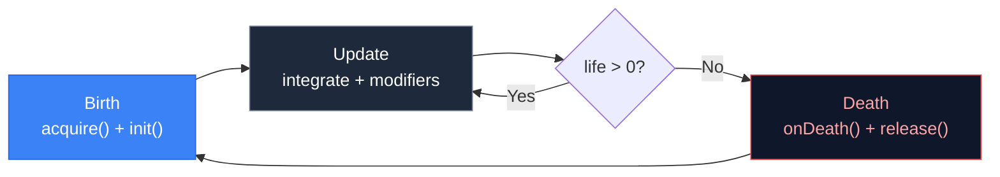

# 3.3 Particle Lifecycle

## Concept

Every particle follows a three-stage lifecycle: **birth**, **update**, and **death**. The particle system orchestrates all three. No particle skips a stage.



## Problem

Without a structured lifecycle, each particle effect must reimplement the same sequence: allocate, initialize, simulate, clean up. Bugs manifest as:

- **Leaked particles** — allocated but never released, memory grows forever
- **Zombie particles** — life <= 0 but still rendered, visible as frozen dots
- **Dirty state** — recycled particle retains old velocity or color

## Naive Lifecycle

```js
function updateParticles(dt) {
  for (let i = 0; i < particles.length; i++) {
    const p = particles[i]

    // Implicit birth
    if (p._justSpawned) {
      p.vx = Math.random() * 100
      p.vy = Math.random() * -200
      p._justSpawned = false
    }

    // Update
    p.x += p.vx * dt
    p.y += p.vy * dt
    p.life -= dt

    // Implicit death
    if (p.life <= 0) {
      particles.splice(i, 1)
      i--
    }
  }
}
```

Birth and death are mixed into the update loop. Initialization runs every frame on newly spawned particles until `_justSpawned` is cleared. Death mutates the array mid-iteration, requiring awkward index correction.

## Engine Lifecycle

`particles/backends/CpuParticleBackend.js:172`

The `CpuParticleBackend.update()` method separates all three stages:

### 1. Begin Frame

Before any particle is updated, `beginFrame` modifiers run. These set up per-frame state (e.g., updating the time value for a turbulence modifier).

### 2. Update (per particle)

For each active particle, the backend:

```js
this._storage.integrateParticle(active[i], dt)
```

This applies physics — velocity += acceleration * dt, position += velocity * dt, life -= dt, ageRatio is recomputed.

Then all `update` modifiers run on the particle — gravity, color lifetime, scale, etc.

### 3. Death Check

After update modifiers, the backend checks `acc.life <= 0`:

```js
if (acc.life <= 0) {
  for (let m = 0; m < dLen; m++) {
    deathMods[m].onDeath(acc, ctx)
  }
  this._stateStore.release(acc)
  this._storage.release(active[i])
} else {
  i++
}
```

If the particle is dead, all `onDeath` modifiers fire first (for spawn-on-death effects like explosions). Then the state store releases per-particle modifier state. Finally, the storage releases the particle back to the pool.

### 4. End Frame

After all particles are processed, `endFrame` modifiers run. These are the counterpart to `beginFrame` — clean up per-frame state.

## Code Walkthrough

The `integrateParticle` method in `SoAParticleStorage` shows the standard physics step:

`particles/storage/SoAParticleStorage.js:305`

```js
integrateParticle(acc, dt) {
  const i = acc._i
  this._vx[i] += this._ax[i] * dt
  this._vy[i] += this._ay[i] * dt
  this._x[i]  += this._vx[i] * dt
  this._y[i]  += this._vy[i] * dt
  this._rotation[i] += this._rotationSpeed[i] * dt
  this._life[i] -= dt
  this._ageRatio[i] = this._maxLife[i] > 0
    ? Math.max(0, Math.min(1, 1 - this._life[i] / this._maxLife[i]))
    : 0
}
```

Velocity is updated by acceleration first, then position by velocity. This is **Euler integration** — the simplest and fastest numerical integration method. Life is decremented by dt. `ageRatio` goes from 0 (born) to 1 (dead).

## Advanced

The death check uses a **while loop with conditional increment** instead of a for loop:

```js
let i = 0
while (i < active.length) {
  // … update …
  if (life <= 0) {
    // release (removes from active array via swap-remove)
    this._storage.release(active[i])
    // i is NOT incremented — the element that swapped in
    // takes the current slot and must be checked next iteration
  } else {
    i++
  }
}
```

This is the swap-remove pattern from Chapter 2.4. When a particle is released, the last active element swaps into its slot. The loop does not increment `i` so the swapped-in particle is processed immediately. This avoids leaving any particle unprocessed after a death.
