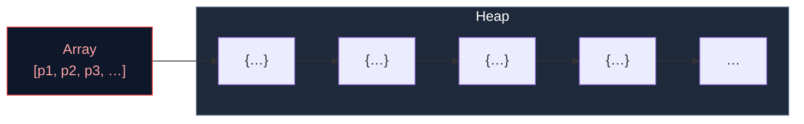

# 3.4 Naive Particle Systems

## Concept

The simplest particle system uses a JavaScript array. New particles are pushed, dead particles are spliced. This is the first approach every developer tries because it requires zero infrastructure.

## Problem

An array-based particle system creates two problems that compound at scale:

**Allocation pressure.** Every call to `push` with a new object allocates memory. In a burst of 500 particles, 500 objects are created. The allocator runs, memory usage spikes, and the garbage collector must eventually sweep all of them.

**Array mutation.** `splice` removes an element by shifting every subsequent element. Removing 500 particles from a 10,000-element array shifts 9,500 elements 500 times — approximately 4.75 million element moves. This is O(n²).

## Naive Implementation

```js
const particles = []

function spawnBurst(count, x, y) {
  for (let i = 0; i < count; i++) {
    particles.push({
      x, y,
      vx: (Math.random() - 0.5) * 200,
      vy: (Math.random() - 0.5) * 200,
      life: 2.0,
      maxLife: 2.0,
      size: 4,
      alpha: 1,
    })
  }
}

function update(dt) {
  for (let i = particles.length - 1; i >= 0; i--) {
    const p = particles[i]
    p.x += p.vx * dt
    p.y += p.vy * dt
    p.life -= dt
    if (p.life <= 0) {
      particles.splice(i, 1)
    }
  }
}
```

This looks clean. It works for 100 particles. It falls apart at 10,000.

## Why It Fails

### 1. GC Stutter

Every `spawnBurst` call creates `count` new objects. When these particles die, the objects become unreachable. The garbage collector must trace and free them. At 60 FPS with continuous spawning, the GC runs every few seconds and pauses for 10–50ms. The player sees a hitch.

### 2. Splice Cost

`splice(i, 1)` when `i` is near the front of a 10,000-element array copies ~10,000 elements in memory. If half the particles die per frame, that is 5,000 * 5,000 average shifts ≈ 25 million element moves per second. This burns CPU time that should go to rendering.

### 3. Cache Misses

Each particle is a separate heap object. Iterating `particles[i]` follows a pointer to a random heap location. The CPU cache cannot predict the next address, causing cache misses on every single particle.



Each arrow is a pointer dereference. The CPU must fetch a new cache line for every particle.

## Engine Solution

jygame avoids all three problems:

| Problem | Naive | jygame |
|---|---|---|
| Allocation | `new` on every spawn | Pre-allocated pool (Chapter 2.3) |
| Death removal | `splice` O(n) | Swap-remove O(1) (Chapter 2.4) |
| Cache misses | Heap objects, scattered | SoA typed arrays, contiguous (Part 6) |

The pool eliminates allocation. Swap-remove eliminates shifting. SoA storage eliminates cache misses.

## Code Walkthrough

Compare the naive update loop with jygame's backend loop. Naive:

```js
for (let i = particles.length - 1; i >= 0; i--) {
  const p = particles[i]
  p.x += p.vx * dt
  p.life -= dt
  if (p.life <= 0) particles.splice(i, 1)
}
```

`particles/backends/CpuParticleBackend.js:196`

```js
while (i < active.length) {
  this._storage.integrateParticle(active[i], dt)
  acc.wrap(active[i])
  // … modifiers run …
  if (acc.life <= 0) {
    this._storage.release(active[i])
    // i not incremented — swapped particle processed next
  } else {
    i++
  }
}
```

Both loops iterate active particles, update physics, check life, and remove dead ones. The naive version allocates on spawn and shifts on death. jygame's version reuses objects and uses swap-remove.

The difference is invisible from outside — both produce the same visual result. The difference appears in the profiler: jygame's loop runs at consistent <1ms while the naive loop stutters from GC and splice cascading.

## Advanced

The naive array approach has one advantage: **simplicity**. For a prototype with fewer than 500 short-lived particles per frame, it is fine. The GC and splice costs only become visible above ~2,000 particles. The rule of thumb:

| Particle count | Approach |
|---|---|
| < 500 | Array + push/splice is acceptable |
| 500 – 5,000 | Pool + swap-remove recommended |
| > 5,000 | SoA storage + SIMD or GPU required |

jygame's architecture supports all three scales with the same API — the storage backend is swappable.
