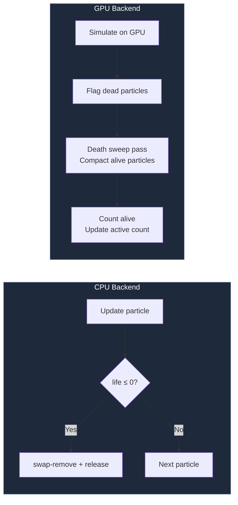

# 3.7 Death Sweep and Compaction

## Concept

When a particle dies, the system must remove it from the active array and return it to the free list. This removal is called a **death sweep**. In the CPU backend, it happens inline during update. In the GPU backend, it is a dedicated pass over the particle buffer.

## Problem

Removing a dead particle from the active array mid-update is simple with swap-remove — O(1) per removal. But removing N dead particles per frame means N swap-removes, each touching the last element in the array. If most particles die simultaneously (e.g., after a burst explosion), the last elements churn rapidly.

On the GPU, the problem is harder. The GPU cannot mutate a dynamic array mid-shader. Dead particles must be flagged and compacted in a separate pass.

## Naive Implementation

```js
for (let i = 0; i < active.length; i++) {
  const p = active[i]
  p.life -= dt
  if (p.life <= 0) {
    // Swap-remove: overwrite with last element, pop
    active[i] = active[active.length - 1]
    active.pop()
    free.push(p)
    i-- // Re-check the swapped element
  }
}
```

This works for CPU. On GPU, you cannot do this inside a shader — GPU threads run in parallel and cannot safely mutate a shared array.

## Engine Solution

`particles/backends/CpuParticleBackend.js:196`

The CPU backend uses the inline death sweep shown above. The GPU backend uses a two-pass approach:

`particles/backends/GpuParticleBackend.js:512`



### GPU Death Sweep

The GPU backend's `_deathSweep()` is a **prefix-sum based compaction**:

1. **Flag.** Each particle slot has an `alive` flag. After the simulation pass, dead particles have `alive = 0`.
2. **Prefix sum.** A compute shader scans the alive flags and computes a prefix sum — for each slot, how many alive particles exist up to that slot. This gives each alive particle its new index in the compacted array.
3. **Scatter.** Another compute shader reads each alive particle and writes it to the position given by the prefix sum.
4. **Count.** The total alive count is the last prefix sum value.

This is O(n) with two GPU dispatches. No swap-remove, no per-particle branching on the CPU.

### WASM/SIMD Death Sweep

`particles/backends/death_sweep_simd_bytes.js`

For CPU backends that want GPU-like compaction performance, jygame ships a precompiled WebAssembly death sweep module using SIMD instructions. It processes up to 16 particles per instruction, compacting the active array in a single linear pass.

## Code Walkthrough

`particles/backends/CpuParticleBackend.js:196`

The CPU death sweep is integrated into the update loop:

```js
while (i < active.length) {
  this._storage.integrateParticle(active[i], dt)
  acc.wrap(active[i])

  for (let m = 0; m < upLen; m++) {
    if (updateMods[m].enabled !== false) {
      mod.update(acc, dt, ctx)
    }
  }

  if (acc.life <= 0) {
    for (let m = 0; m < dLen; m++) {
      if (deathMods[m].enabled !== false) {
        mod.onDeath(acc, ctx)
      }
    }
    this._stateStore.release(acc)
    this._storage.release(active[i])
    // i NOT incremented — swapped particle needs processing
  } else {
    i++
  }
}
```

`particles/storage/SoAParticleStorage.js:155`

The release method performs the swap-remove on the active array:

```js
release(acc) {
  const idx = acc._activeIndex
  const last = this._activeAccessors.pop()
  if (idx < this._activeAccessors.length) {
    this._activeAccessors[idx] = last
    last._activeIndex = idx
  }
  acc._activeIndex = -1
  this._freeList[this._freeCount] = acc._i
  this._freeCount++
  this._resetSlot(acc._i)
}
```

The slot is reset (`_resetSlot`) so the next acquire gets a clean particle.

## Advanced

**Death modifiers** run before the particle is released. This enables spawn-on-death patterns — an explosion particle that creates 10 smaller sparks when it dies:

```js
class SpawnOnDeathModifier {
  onDeath(particle, ctx) {
    ctx.system.emit(10, (p) => {
      p.x = particle.x
      p.y = particle.y
      p.vx = (Math.random() - 0.5) * 100
      p.vy = (Math.random() - 0.5) * 100
    })
  }
}
```

The `ctx` (modifier context) provides access to the particle system so death modifiers can spawn new particles during the death sweep. These new particles are appended to the active array and processed in the same frame.

GPU death sweep is covered in depth in Part 9 (WebGPU). WASM/SIMD death sweep is covered in Part 10.
