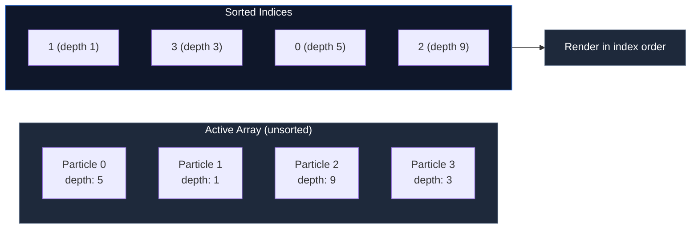

---
next:
  text: '4.1 Why Modifiers?'
  link: '/4-modifiers/01-why-modifiers'
---

# 3.8 Sorting Particles

## Concept

Particles are drawn in the order they appear in the active array. Without sorting, a particle behind another particle may render on top of it, breaking visual depth. **Sorting** reorders the render order so particles appear correctly.

## Problem

Depth perception in 2D particle effects depends on draw order. Larger, brighter particles should appear in front. Smaller, dimmer particles should appear behind. Without sorting:

- Smoke renders on top of fire, making the fire look like it is behind the smoke
- Foreground rain renders behind background rain, breaking the 3D illusion
- Sparkles render in arbitrary order, creating visual noise

Sorting every frame costs CPU time. The tradeoff is visual quality vs performance.

## Naive Implementation

```js
function renderParticles(ctx, particles) {
  particles.sort((a, b) => a.depth - b.depth)
  for (const p of particles) {
    drawParticle(ctx, p)
  }
}
```

`Array.sort()` on the particle array every frame is O(n log n). For 10,000 particles, that is ~140,000 comparisons per frame. The sort also mutates the active array, which breaks the update loop if called mid-frame.

## Engine Solution

`particles/ParticleSortManager.js:6`

jygame's `ParticleSortManager` does not mutate the active array. It maintains a separate **sorted index array**:



The renderer iterates the sorted index array and renders particles in that order. The active array stays in insertion order, preserving stability for other operations.

## Code Walkthrough

`particles/ParticleSortManager.js:148`

The `sort()` method builds the index array and sorts it:

```js
sort() {
  if (this.sortEveryFrame) {
    this._sortDirty = true
  }
  if (!this._sortDirty) return

  const count = this._storage.activeCount
  this._ensureSortIndices(count)
  const buf = this._sortedIndices

  for (let i = 0; i < count; i++) {
    buf[i] = i
  }

  if (count > 1) {
    const cmp = this._getComparator()
    if (cmp) {
      buf.length = count
      buf.sort(cmp)
    }
  }

  this._sortDirty = false
}
```

The index array is initialized to sequential indices (`0, 1, 2, …`), then sorted with the field comparator. The comparator reads the sort field from the storage's typed arrays directly — no particle objects involved:

```js
// For depth sort:
(a, b) => storage._depth[a] - storage._depth[b]
```

`particles/ParticleSortManager.js:69`

Available sort modes:

| Mode | Field | Use case |
|---|---|---|
| `"none"` | — | No sorting, fastest |
| `"age"` | `_lifeRatio` | Oldest first (smoke fades behind) |
| `"reverseAge"` | `_lifeRatio` | Newest first (sparkles on top) |
| `"depth"` | `_depth` | Manual z-ordering |
| `"reverseDepth"` | `_depth` | Reverse z-ordering |
| `"size"` | `_size` | Small behind, large in front |
| `"reverseSize"` | `_size` | Large behind, small in front |
| `"custom"` | User function | Any custom comparator |

## Code Walkthrough

`particles/ParticleSystem.js:60`

Setting the sort mode on the system:

```js
system.sortMode = 'depth'
```

Setting a custom sort function:

```js
system.sortFunction = (a, b) => b.alpha - a.alpha
// Most opaque renders first
```

The render pipeline checks the sort mode:

`particles/backends/CpuParticleBackend.js:248`

```js
render(ctx) {
  const count = this.activeCount
  if (count === 0) return

  let renderData
  if (this._sortManager.sortMode === 'none') {
    renderData = this._buildRenderData(null, count)
  } else {
    this._sortManager.sort()
    renderData = this._buildRenderData(
      this._sortManager.sortedIndices, count
    )
  }

  const buf = this._commandBuffer
  buf.clear()
  renderData.fillCommandBuffer(buf)
  this._renderer.render(buf, ctx)
}
```

When `sortMode` is `"none"`, indices are skipped and particles render in active-array order — fastest path.

When sorting is enabled, the sorted indices are passed to `_buildRenderData`. The render data command buffer is filled in index order. The renderer draws particles in that order.

## Advanced

**Sort every frame.** Set `sortEveryFrame = true` to force re-sorting every frame regardless of whether the sort manager thinks data is dirty. This is useful when particles are added or removed frequently and you cannot track dirtiness.

**Sort on emit only.** By default, `_sortDirty` is set to `true` whenever particles are emitted or released. The sort runs once per frame if dirty. This avoids unnecessary sorts when the particle set is static (e.g., a finished explosion fading out).

**Custom sort function performance.** Built-in modes (`depth`, `age`, `size`) read from typed arrays directly — individual field access per comparison. Custom sort functions receive the full particle accessor object. For 10,000+ particles, the function call overhead per comparison can dominate. Prefer built-in modes at scale.

**Stability.** JavaScript's `Array.sort()` is stable in modern engines (V8, SpiderMonkey). Particles with equal sort values preserve their relative order. This means inserting particles in a specific order within the same depth layer is respected by the renderer.
